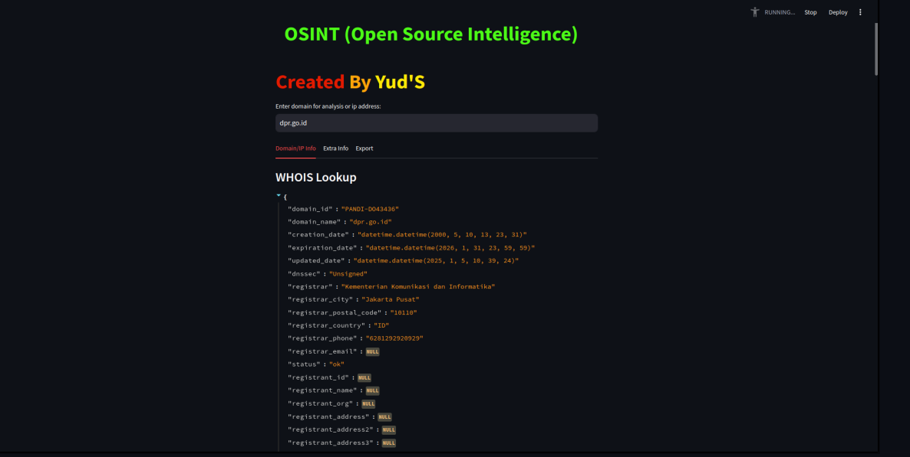

# YudS-OSINT

YudS-OSINT is an Open Source Intelligence (OSINT) tool built with Python that utilizes various libraries to assist users in gathering information from multiple sources. This project is designed to be user-friendly for both beginners and professionals.

## Screnshoot


## Key Features
- Integration with multiple APIs via `api_integration.py`.
- Data analysis using `pandas`, `plotly`, and `streamlit`.
- Customizable settings through `config.py`.
- Task automation using `schedule`.

## Prerequisites
Before starting, ensure you have:
- **Python** version 3.8 or later.
- **Git** to clone the repository.
- **Virtual environment** to isolate project dependencies.

## Installation Steps
Follow the steps below based on your operating system.
Support all Distribution Linux, MacOS, Windows.

### Linux/macOS
1. **Install git in Linux/MacOS**

   - **Open Terminal**

   - Debian/Ubuntu
   ```debian/ubuntu
   sudo apt install git
   ```
   - Fedora
   ```Fedora
   sudo dnf install git
   ```
   - Arch Linux
   ```Arch Linux
   sudo pacman -S git
   ```
   - MacOS
   ``` MacOS
   brew install git
   ```
3. **Clone the Repository**
   ```bash
   git clone https://github.com/yudiiansyaah/YudS-OSINT.git
cd YudS-OSINT
   ```

4. **Create and Activate a Virtual Environment**
   ```bash
   python3 -m venv venv
   source venv/bin/activate
   ```

5. **Install Dependencies**
   ```bash
   pip install -r requirements.txt
   ```

6. **Run the Application**
   - To run the API with Uvicorn:
     ```bash
     cd /YudS-OSINT/api
     ```
     ```
     python3 my_api.py
     ```
    - To start the application:
     - Open new terminal
     ```bash
     cd Yuds-OSINT
     streamlit run main.py
     ```

### Windows
1. **Install Git in CMD**
   ```cmd
   winget install --id Git.Git -e --source winget
   ```
2. **Clone the Repository**
   ```cmd
   git clone https://github.com/yudiiansyaah/YudS-OSINT.git
   cd YudS-OSINT
   ```

3. **Create and Activate a Virtual Environment**
   ```cmd
   python -m venv venv
   venv\Scripts\activate
   ```

4. **Install Dependencies**
   ```cmd
   pip install -r requirements.txt
   ```

5. **Run the Application**
   - To run the API with Uvicorn:
     ```bash
     cd /YudS-OSINT/api
     ```
     ```
     python my_api.py
     ```
    - To start the application:
     - Open new Cmd
     ```bash
     cd Yuds-OSINT
     streamlit run main.py
     ```

## Troubleshooting
- **Dependency Installation Issues**:
  - Ensure you are using the correct Python version.
  - Try updating `pip`:
    ```bash
    pip install --upgrade pip
    ```

- **Application Execution Issues**:
  - Make sure the virtual environment is activated before running commands.
- **Linux/MacOS**:
  - ```bash
   source venv/bin/activate
    ```
- **Windows**:
  -``` bash
   venv/Scripts/activate
   ```
  - Check the configuration in `config.py`.

- **API Not Running**:
  - Ensure the port used by Uvicorn is not occupied by another application.
  - Run the API on a specific port:
    ```bash
    uvicorn api_integration:app --reload --port 8080
    ```

## Directory Structure
```
YudS-OSINT-main/
|-- api/                  # API directory
|-- api_integration.py    # API integration file
|-- async_utils.py        # Asynchronous utilities
|-- config.py             # Application configuration
|-- core_functions.py     # Core functions
|-- main.py               # Main application file
|-- requirements.txt      # Python dependencies
|-- utils.py              # Additional utilities
|-- ...
```

## Contribution
If you wish to contribute to this project, please fork this repository and submit a pull request with your changes.

## License
This project is licensed under the [MIT License](LICENSE).

